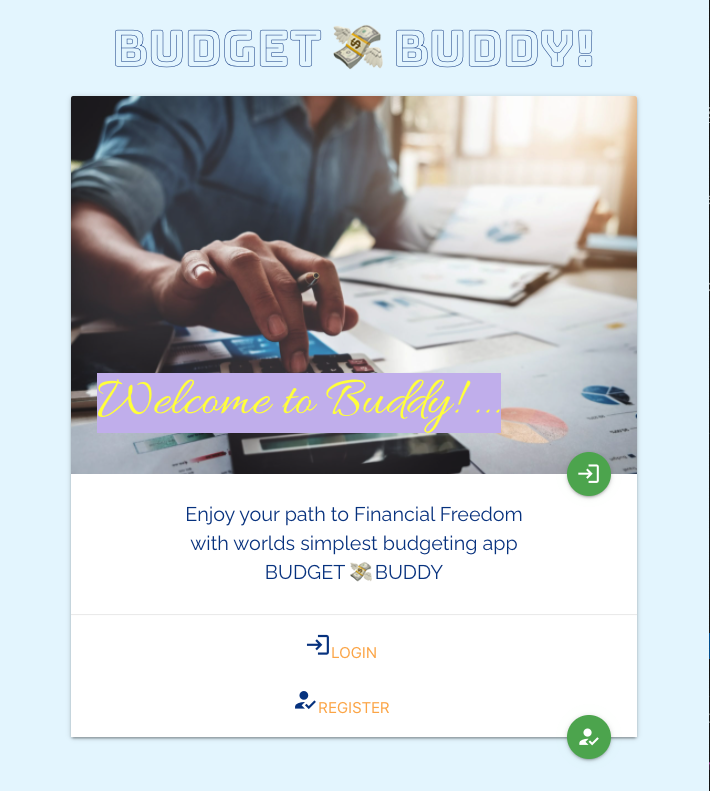
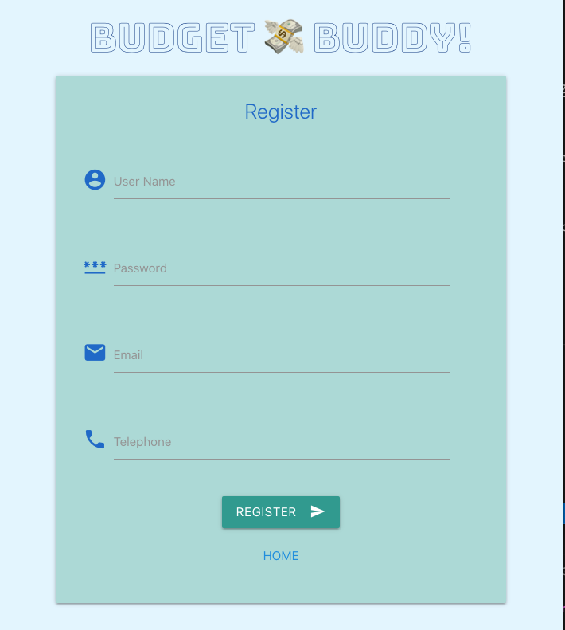
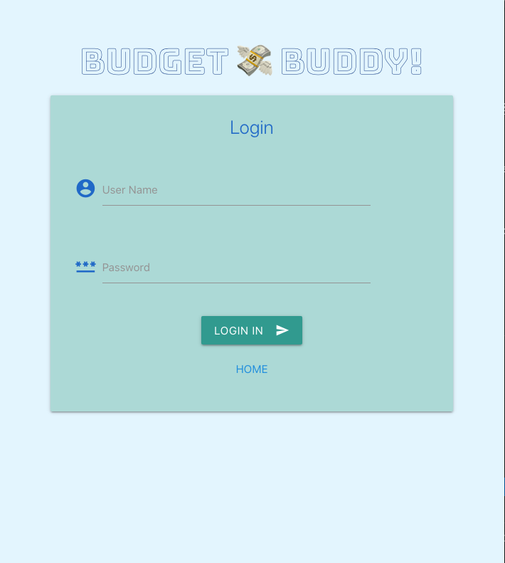

# Project #4: Capstone Project

# BUDGET 💸  BUDDY 

### *** Jonathan Acheampong ***

 

### [Budget Buddy](https://budget-buddy-front.herokuapp.com/#/) is a simple personal financial app. It enable users to estimate their monthly budget based on income/wages, expense - needs and wants.
 
Project idea developed from my interest in personal finance.  I am interested in the principle of Financial Independence and Retire Entire (FIRE)

  

### Main Page
 

### Registration Page
 

### Login Page
 

 

## 1. Technology Stack:
### 1.1 Backend [Github](https://github.com/jacheampong/budget-buddy-backend)
* Node [Express](https://expressjs.com/) with [MongoDB](https://www.mongodb.com/) +  [Mongoose js](https://mongoosejs.com/)
* Deployed at [budget-buddy-end](https://budget-buddy-end.herokuapp.com/)

 

### 1.2 Frontend App:
### [Github Repo](https://github.com/jacheampong/budget-buddy-frontend)
###  [Heroku Depolyed](https://budget-buddy-front.herokuapp.com/)
This project was bootstrapped with [Create React App](https://github.com/facebook/create-react-app).

* [React JavaScript library](https://reactjs.org/)
* HTML, JavaScript, Google Chrome
* [Materializecss](https://materializecss.com/) for CSS
* [React-materialize](https://github.com/react-materialize/react-materialize) 
* AJAX and [AXIOS API](https://github.com/axios/axios) for API backed Access
* Postman for API/backend Testing
* Heroku cloud application platform for deployment

 

## 2. Backend API Endpoints
<table>
<thead>
<tr>
<th>#</th>
<th>Component</th>
<th>API Call</th>
<th>Purpose</th>
</tr>
</thead>
<tbody>
<tr>
<td>1</td>
<td>User</td>
<td>GET /api/users/:id</td>
<td>List user with the specified Id </td>
</tr>
<tr>
<td>2</td>
<td>User</td>
<td>POST /api/users</td>
<td>Create a new User </td>
</tr>
<tr>
<td>3</td>
<td>Budget</td>
<td>GET /api/budgets</td>
<td>List of all Budgets albums ***</td>
</tr>
<tr>
<td>4</td>
<td>Budget</td>
<td>POST /api/budgets</td>
<td>Create a new Budget </td>
</tr>
<tr>
<td>5</td>
<td>Budget</td>
<td>GET /api/budgets/:id</td>
<td>Get A Budget by budget ID ***</td>
</tr>
<tr>
<td>6</td>
<td>Budget</td>
<td>PATCH /api/budgets/:id</td>
<td>Update A Budget by Budget ID</td>
</tr>
<tr>
<td>7</td>
<td>Budget</td>
<td>DELETE /api/budgets/:id</td>
<td>Delete Budget by Budget ID ***</td>
</tr>
<tr>
<td>8</td>
<td>Budget</td>
<td>GET /api/budgets/user/:id</td>
<td>Get Budget by User ID</td>
</tr>
<tr>
<td>9</td>
<td>Session</td>
<td>POST /api/sessions/</td>
<td>Find User and add to current session</td>
</tr>
<tr>
<td>10</td>
<td>Session</td>
<td>DELETE /api/sessions/logout</td>
<td>Destroys the current session</td>
</tr>
</tbody>
</table>

*** Not Active from frontend app 

 

## 3. Design Components
### [Wireframes](https://docs.google.com/presentation/d/1rZr7QCor-U1FLlpr4caa1bF7kRCneiAOUoVqS7xn9kA/edit?usp=sharing)

#### 3.1 Wireframe - Main Page
 
#### 3.2 Wireframe - Register Page
 

#### 3.3 Wireframe - Budget Page
 

#### 3.3 Wireframe - 50/30/20 Budget Page
 

 

## 4. User Stories

1. As a new user, I should be able to register and use app **Status: Completed**
2. As a registered user, I should to be able to log in and use app **Status: Completed**
3. As a registered user, I should be to see home page when I log in to app  **Status: Completed**
4. As a logged in user, I should be able to create a new budget sheet **Status: Completed**
5. As a logged in user, I should be able to edit budget sheet **Statu:s Completed**
6.  As a logged in user, I should be able to logout **Status: Completed**
7. As a logged in user, I should be able to create a new 50/30/20 estimate **Status: Completed**
8. As a logged in user, I should be able to delete budget sheet **Status: Work In Progress**
9. As a user, I should be able to create more than 1 budget sheet **Status: Future Enhancement**
10. As a logged in user, I should be able to delete more than 1 budget sheet **Status: Future Enhancement**

 

## 5. MVP (Minimum Viable Product) Requirement 
### Technical Requirements
* Create 2 apps: React frontend that communicates with a backend API **Status: Complete**

* Backend API Options: Express with Mongo + Mongoose **Status: Complete**

* Be a complete product **Status: Complete**
* Implement thoughtful user stories **Status: Complete**
* Be deployed online **Status: Complete**

 

## 6. Bonus Suggestions
* Add Authentication **Status: Complete**
 
 

## 7. Unsolved Issues and Future Enhancements
* Delete Budget sheet button - currently Work in progress
* Ability to create and save more than one (1) budget sheet per user account
* Add Financial news feed by calling third party api
* Incorporate Redux
* Use a Docker container for development and deployment
* Move some of the code in App.js into a separate component: Homepage and Logout 

 

## Available Scripts

In the project directory, you can run:

### `npm start`

Runs the app in the development mode.\
Open [http://localhost:3000](http://localhost:3000) to view it in the browser.

The page will reload if you make edits.\
You will also see any lint errors in the console.

### `npm test`

Launches the test runner in the interactive watch mode.\
See the section about [running tests](https://facebook.github.io/create-react-app/docs/running-tests) for more information.

### `npm run build`

Builds the app for production to the `build` folder.\
It correctly bundles React in production mode and optimizes the build for the best performance.

The build is minified and the filenames include the hashes.\
Your app is ready to be deployed!

See the section about [deployment](https://facebook.github.io/create-react-app/docs/deployment) for more information.

## Learn More

You can learn more in the [Create React App documentation](https://facebook.github.io/create-react-app/docs/getting-started).

To learn React, check out the [React documentation](https://reactjs.org/).

## Axios
Promise based HTTP client for the browser and node.js

[Axios github](https://github.com/axios/axios)

[Axios npm](https://www.npmjs.com/package/axios)