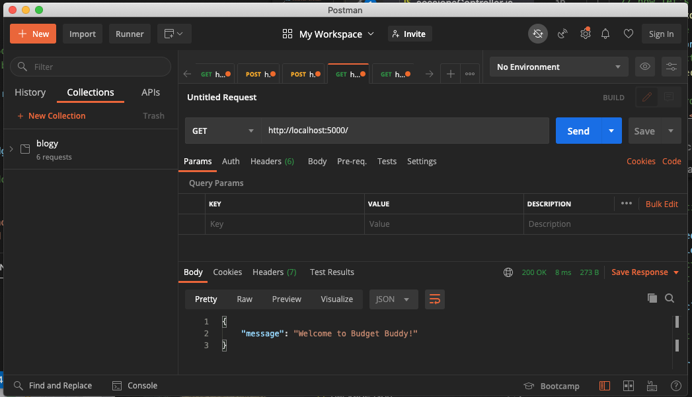
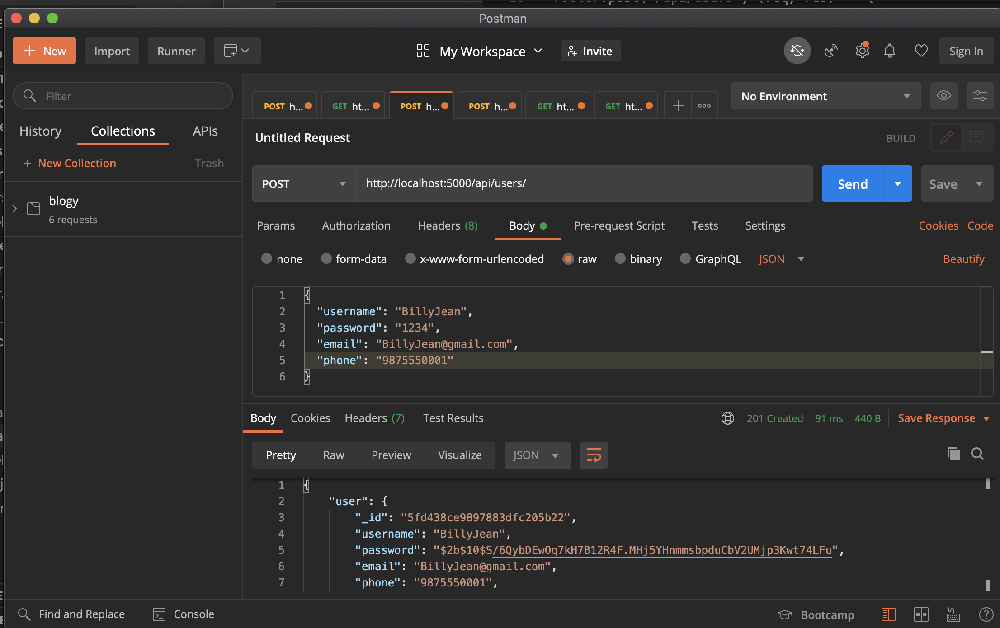
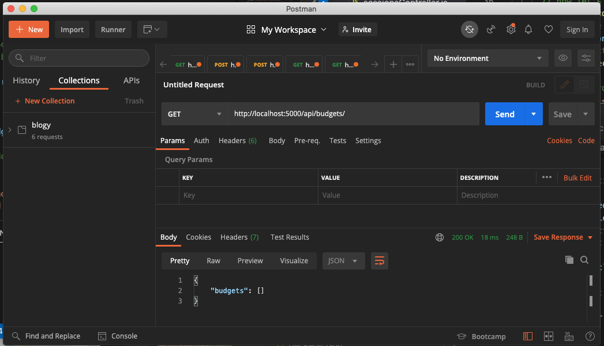
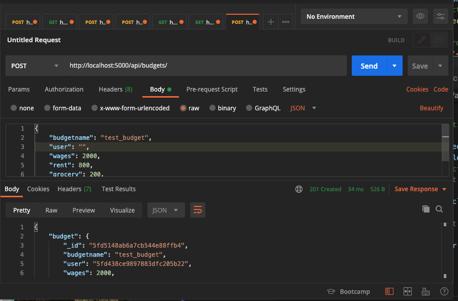
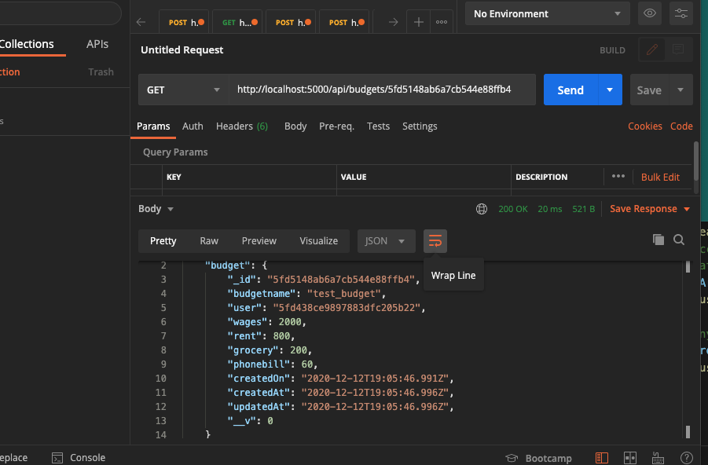

# Planning

## 1. Project Idea

### 1.1. Highlights
Project idea developed from my interest in personal finance.  I am interested in the principle of Financial Independence and Retire Entire (FIRE)

- Easy to use Budget spreadsheet; enter incomes and expenses and get a summary of total 
- Easy to use 50/30/20 Budget estimator
- Easy to read Budgeting information 

### 1.2. Planning Summary
After crossing several ideas of my initial list, I settled on creating a financial/budget application. I wanted to create a simple yet elegant tool to entice users. 

I developed a wireframe for the homepage before progressing to registration and login page. Regular Budget sheet followed then 50/30/20 budget estimator wireframe. 

Developed user stories followed by Object, fields and Object relationships. 

 

## 2. Wireframing

### 2.1. Wireframe - Main Page

### 2.2. Wireframe - Registration Page

### 2.3. Wireframe - Budget Page

### 2.4. Wireframe - 50/30/20Budget Page

 

## 3. User Stories

1. As a new user, I should be able to register and use app 
2. As a registered user, I should to be able to log in and use app 
3. As a registered user, I should be to see home page when I log in to app  
4. As a logged in user, I should be able to create a new budget sheet 
5. As a logged in user, I should be able to edit budget sheet 
6.  As a logged in user, I should be able to logout 
7. As a logged in user, I should be able to create a new 50/30/20 estimate
8. As a logged in user, I should be able to delete budget sheet 
9. As a user, I should be able to create more than 1 budget sheet 
10. As a logged in user, I should be able to delete more than 1 budget sheet 

 

## 4. API
### 4.1 Technical Requirements: 
Build 2 apps: React frontend that communicates with a backend API.

### 4. 2 Backend API
Decided to develop backend api with
- Developed with Express with Mongo + Mongoose 
- Node [Express](https://expressjs.com/) with [MongoDB](https://www.mongodb.com/) +  [Mongoose js](https://mongoosejs.com/)

### 4.3. Confirmation for API

Testing to confirm various requests was done using Postman and the browser console: \
Below is screenshots of testing some the request 

### 4.3.1 Wireframe - Main Page

### 4.3.2 Wireframe - Create User

### 4.3.3 Wireframe - Get All Budgets (empty list) 

### 4.3.4 Wireframe - Create/Post Budget

### 4.3.4 Wireframe - Show/Get Budget

## 5. REACT Frontend
Frontend app was developed with:
* [React JavaScript library](https://reactjs.org/)
* HTML, JavaScript, Google Chrome
* [Materializecss](https://materializecss.com/) for CSS
* [React-materialize](https://github.com/react-materialize/react-materialize) 

Initially, tested [Ant Design](https://ant.design/) and [bootstrap](https://getbootstrap.com/) CSS framework. \
But settled on [Materializecss](https://materializecss.com/) after protyping with all 3 CSS frameworks. 
